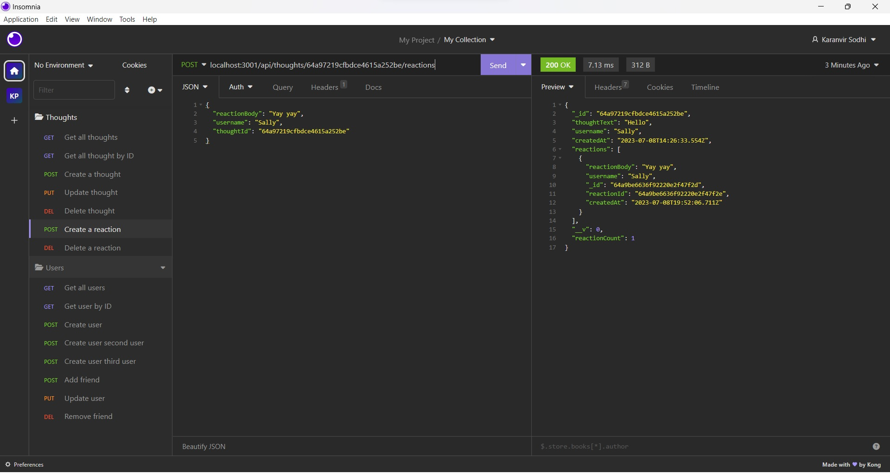

# 18-SocialNetworkApi

# Description
The is a back end application which will allow one to create users, thoughtd, and reactions and store them into a database.  The data is then able to be upated, deleted, or added on to one another if needed.

# Mentions
Had help from tutoring session through Northwestern Coding Camp

# Links

Live Video: https://drive.google.com/file/d/11BXP97cADOPKCAszGo-GZjOe9qDbTVJn/view

Github Repo: https://github.com/karsodhi/18-SocialNetworkApi

# Screenshot

